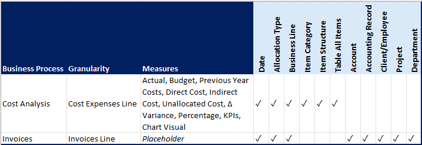
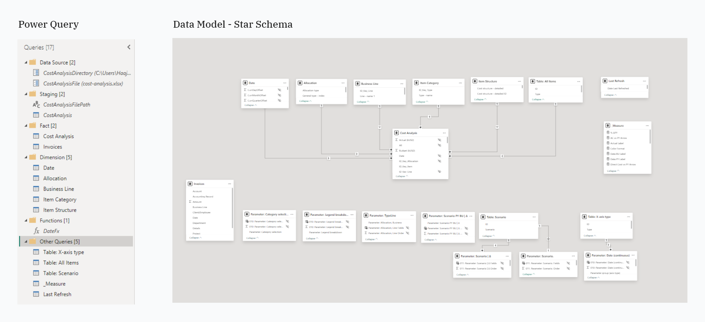
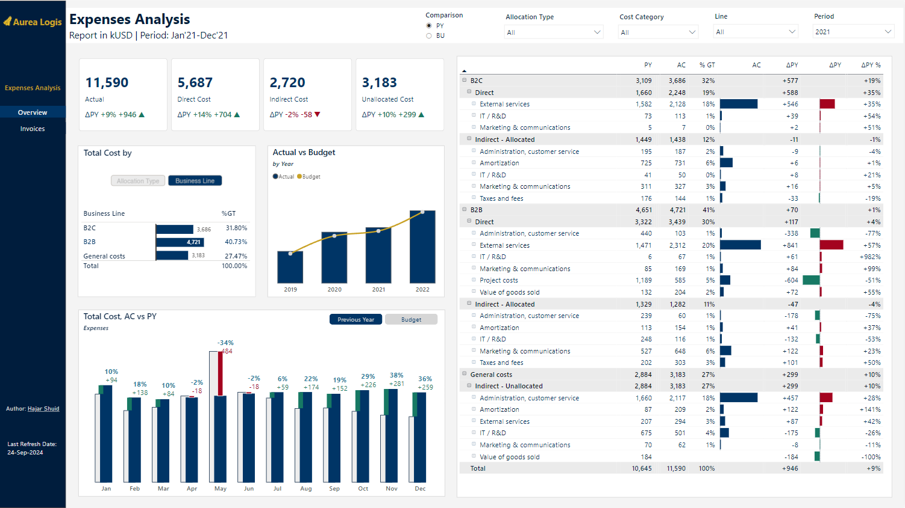

# Aurea Logis Financial Expense Analysis Report

- [Aurea Logis Financial Expense Analysis Report](#aurea-logis-financial-expense-analysis-report)
  - [Project Overview](#project-overview)
  - [Problem Statement](#problem-statement)
  - [Data Source](#data-source)
  - [Tools Used](#tools-used)
  - [Techniques Used](#techniques-used)
  - [Report Features](#report-features)
  - [Report Visualization](#report-visualization)
  - [Key Insights](#key-insights)
  - [Recommendations](#recommendations)
  - [Future Improvements](#future-improvements)
  - [How to Use](#how-to-use)
  - [License](#license)

## Project Overview
This project presents a comprehensive financial expense analysis report for Aurea Logis, developed using Power BI. The report provides insights into the company's expense structure across different business lines and cost categories, enabling data-driven decision-making for financial optimization.

## Problem Statement
Aurea Logis company needed to analyze and optimize its expense structure across different business lines and cost categories to improve financial performance and support strategic decision-making. The company required a comprehensive view of its expenses, including comparisons to previous periods and budgets, to identify areas of concern and opportunities for cost optimization.

## Data Source
The data for this project was sourced from Aurea Logis's financial records, covering the period from January 2019 to December 2022, with historical data for comparison. The dataset includes:
- Detailed expense records
  - _remove invoices details due to confidential information - put as 'Placeholder'_
- Budget information
- Business line categorizations
- Cost allocations (Direct, Indirect, Unallocated)

(Note: All data used in this project is anonymized and for demonstration purposes only.)

## Tools Used
- Power BI for report development. Visualization at [here](#report-visualization)
- Excel for data preparation. Refer at [here](data/cost-analysis.xlsx)
- Power Query for data transformation. Refer script at [here](scripts/cost-analysis-transformation.pq)
- DAX: Refer DAX measures at [here](scripts/dax-measures.xlsx)
- GitHub for project documentation and version control

## Techniques Used
1. Create data warehouse bus matrix to decide business process
   
    

2. Managing queries and data sources
3. ETL processes using Power Query 
4. Data modeling with star schema. 
   - **Cardinality Relationship:** **Many-to-one**, single direction relationships from Fact Tables to corresponding Dimension Tables
   
   

5. Advanced DAX measures for complex calculations, custom visuals
6. Custom visuals for enhanced data presentation
7. Parameterized reports for user flexibility
8.  Row-level security (RLS) implementation by Business Line/Department/Project for data privacy
9.  Automate data refresh with Power Automate

## Report Features
1. **Expense Overview**: Displays total expenses, direct costs, indirect costs, and unallocated costs with year-over-year(YoY) comparisons.
2. **Business Line Analysis**: Breaks down costs by B2C, B2B, and General costs categories. 
3. **Allocation Type Analysis**: Breaks down costs by direct costs, indirect costs, and unallocated costs categories. 
4. **Actual vs Budget Comparison**: Chart showing actual expenses against budgeted amounts from 2019 to 2022.
5. **Monthly Trend Analysis**: Bar chart displaying monthly expense trends with year-over-year comparisons.
6. **Monthly Trend Analysis**: Bar chart displaying monthly expense trends with budget comparisons.
7. **Detailed Cost Breakdown**: Hierarchical view of costs by business line, allocation type, and specific cost categories. Choose to view the breakdown either comparison `Actual vs Budget` OR `Actual vs Previous Year`.
8. **Interactive Filters**: Allows users to filter data by comparison type (PY/BU), allocation type, cost category, line, and period.

## Report Visualization

🔎[Interactive Report](https://app.powerbi.com/view?r=eyJrIjoiZGZjNThkNDgtMWI4MC00ZGExLWJjZjEtZmVmNzdkM2QwMTIyIiwidCI6ImFlYmMzMTg4LWU3MzYtNGRlYi05MzJiLWRjNDU5OGMwNDQ3ZCIsImMiOjN9)

_**Notes:** For page **Invoices**, it doesn't contains any information and only as placeholder due to confidential information._

## Key Insights

_Sample insights by performing analysis as of 2021._

1. **Overall Expense Growth**: Total expenses increased by 9% (∆PY +946K) compared to the previous year 2020, reaching $11,590K for the period Jan'21-Dec'21.
2. **Cost Structure Breakdown**: 
   - Direct costs: $5,687K (49% of total, +14% YoY)
   - Indirect costs: $2,720K (-2% YoY)
   - Unallocated costs: $3,183K (+10% YoY)
3. **Business Line Performance**:
   - B2C: $3,686K (+19% YoY, 31.80% of total)
   - B2B: $4,721K (+1% YoY, 40.73% of total)
   - General costs: $3,183K (+10% YoY, 27.47% of total)
4. **Notable Cost Category Changes**:
   - Significant increases in external services for both B2C and B2B
   - 51% decrease in B2B project costs
   - 77% decrease in B2B administration and customer service costs
5. **Monthly Expense Trends**: Highest decrease in May (-34%), highest increase in November (+38%)
6. **Budget Performance**: Actual expenses consistently above budget from 2019 to 2021

## Recommendations
Based on the analysis, the following recommendations are proposed:
1. Review and optimize external services costs in both B2C and B2B segments.
2. Investigate the significant decrease in B2B project costs to ensure it aligns with strategic goals.
3. Analyze the efficiency improvements in B2B administration and customer service for potential application in other areas.
4. Implement more accurate budgeting processes to address the consistent over-budget performance.
5. Develop strategies to manage costs during the latter months of the year when expenses tend to increase.

## Future Improvements
To enhance the report and analysis, consider:
1. Incorporating revenue data to calculate and visualize profit margins.
2. Adding forecasting capabilities to predict future expense trends.
3. Implementing drill-through capabilities for deeper analysis of specific cost categories.
4. Creating a cost allocation simulator to model different allocation scenarios.

## How to Use
1. Access the Power BI report using the following link: [Aurea Logis Expense Analysis Report](https://app.powerbi.com/view?r=eyJrIjoiZGZjNThkNDgtMWI4MC00ZGExLWJjZjEtZmVmNzdkM2QwMTIyIiwidCI6ImFlYmMzMTg4LWU3MzYtNGRlYi05MzJiLWRjNDU5OGMwNDQ3ZCIsImMiOjN9)
2. Use the filters on the right side of the report to adjust the view as needed.
3. Hover over data points for more detailed information.
4. Click on elements in the charts to cross-filter other visualizations.

## License
This project is licensed under the MIT License - see the [LICENSE.md ](LICENSE)file for details.

 

[🔼 Back to top](#aurea-logis-financial-expense-analysis-report)